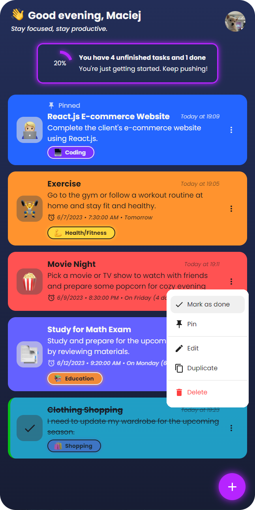
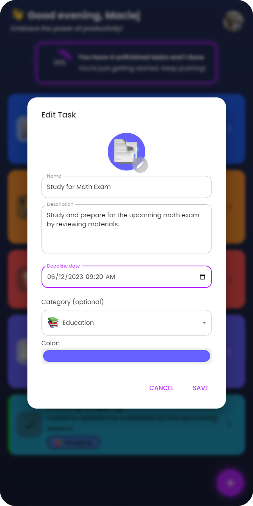

<!-- prettier-ignore -->
# 📝React.js Todo App

[https://react-cool-todo-app.netlify.app/](https://react-cool-todo-app.netlify.app/)

## 📷 Screenshots





## ⚡ Features

- All tasks are stored in local storage
- The app features different emoji styles to choose from, including Apple, Facebook, Twitter, Google and NATIVE!
- It has a clean and responsive design, ensuring a smooth user experience across different devices.
- Customizable Categories: Users can create and personalize task categories to suit their preferences.
- Works offline: This app is a Progressive Web App (PWA), which means it can be installed on your device and used even when you're offline. You can access and manage your tasks without an internet connection, ensuring uninterrupted productivity.

## 🚀 Performance


## ⚙️ Installation

To install and run the project locally, follow these steps:

- Clone the repository: `git clone https://github.com/maciekt07/TodoApp.git`
- Navigate to the project directory: `cd TodoApp`
- Install the dependencies: `npm install`
- Start the development server: `npm run dev`

The app will now be running at [http://localhost:5173/](http://localhost:5173/).

```json
{
  "name": "sdgdsgsg",
  "createdAt": "2023-06-18T20:29:26.987Z",
  "profilePicture": null,
  "emojisStyle": "apple",
  "tasks": [
    {
      "id": 1687120264964.0132,
      "done": false,
      "pinned": true,
      "name": "Exercise",
      "description": "Go to gym",
      "emoji": "1f4aa",
      "color": "#ffd06b",
      "date": "2023-06-18T20:31:04.964Z",
      "deadline": "2023-06-20T04:30:00.000Z",
      "category": [
        {
          "id": 4,
          "name": "Health/Fitness",
          "emoji": "1f4aa",
          "color": "#ffdf3d"
        }
      ]
    },
    {
      "id": 1687120368016.5132,
      "done": false,
      "pinned": false,
      "name": "Exercise",
      "description": "Go to gym",
      "emoji": "1f4aa",
      "color": "#6bceff",
      "date": "2023-06-18T20:32:48.016Z",
      "deadline": "2023-06-20T04:30:00.000Z",
      "category": [
        {
          "id": 1,
          "name": "Home",
          "emoji": "1f3e0",
          "color": "#1fff44"
        }
      ],
      "lastSave": "2023-06-18T20:55:57.764Z"
    },
    {
      "id": 1687122441459.8252,
      "done": false,
      "pinned": false,
      "name": "xd",
      "color": "#24ffbd",
      "date": "2023-06-18T21:07:21.459Z",
      "category": [
        {
          "id": 3,
          "name": "Personal",
          "emoji": "1f464",
          "color": "#e843fe"
        }
      ],
      "lastSave": "2023-06-19T21:02:12.289Z"
    },
    {
      "id": 1687208538387.4097,
      "done": false,
      "pinned": false,
      "name": "xd",
      "color": "#7024ff",
      "date": "2023-06-19T21:02:18.387Z",
      "category": [
        {
          "id": 5,
          "name": "Education",
          "emoji": "1f4da",
          "color": "#ff8e24"
        }
      ],
      "lastSave": "2023-06-19T21:02:24.494Z"
    },
    {
      "id": 1687209415581.8254,
      "done": true,
      "pinned": false,
      "name": "xd",
      "color": "#24ffbd",
      "date": "2023-06-19T21:16:55.581Z",
      "lastSave": "2023-06-19T21:16:59.066Z"
    }
  ],
  "settings": [
    {
      "enableCategories": true,
      "doneToBottom": false,
      "enableGlow": true
    }
  ],
  "categories": [
    {
      "id": 1,
      "name": "Home",
      "emoji": "1f3e0",
      "color": "#1fff44"
    },
    {
      "id": 2,
      "name": "Work",
      "emoji": "1f3e2",
      "color": "#248eff"
    },
    {
      "id": 3,
      "name": "Personal",
      "emoji": "1f464",
      "color": "#e843fe"
    },
    {
      "id": 4,
      "name": "Health/Fitness",
      "emoji": "1f4aa",
      "color": "#ffdf3d"
    },
    {
      "id": 5,
      "name": "Education",
      "emoji": "1f4da",
      "color": "#ff8e24"
    }
  ]
}
```
