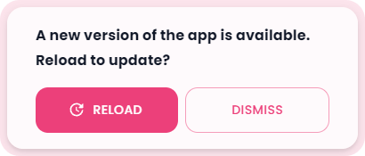

<h1>📝React.js Todo App</h1>

## [https://react-cool-todo-app.netlify.app/](https://react-cool-todo-app.netlify.app/)

## 💻 Tech Stack

<ul style="display: flex; flex-direction: column; gap:10px;">
  <li style="vertical-align: middle;">
     React
  </li>
    <li style="vertical-align: middle;">
     Typescript
  </li>
    <li style="vertical-align: middle;">
     Vite
  </li>
  <li style="vertical-align: middle;">
     Vitest
  </li>
  <li style="vertical-align: middle;">
     Emotion
  </li>
    <li style="vertical-align: middle;">
     Material UI (MUI)
  </li>
</ul>

## ⚡ Features

### 🔗 Share Tasks by Link or QR Code

Easily share your tasks with others using a link or QR code, with the option to download the QR code.

**[Example Link](https://react-cool-todo-app.netlify.app/share?task=%7B%22done%22%3Afalse%2C%22pinned%22%3Atrue%2C%22name%22%3A%22Website%20Development%22%2C%22description%22%3A%22Create%20a%20landing%20page%20with%20React.js%20for%20client.%20https%3A%2F%2Fwww.youtube.com%2Fwatch%3Fv%3DbMknfKXIFA8%26t%3D23s%26ab_channel%3DfreeCodeCamp.org%22%2C%22emoji%22%3A%221f468-1f3fc-200d-1f4bb%22%2C%22color%22%3A%22%23b624ff%22%2C%22date%22%3A%222024-02-14T23%3A26%3A21.095Z%22%2C%22category%22%3A%5B%7B%22id%22%3A168712541746303%2C%22name%22%3A%22Coding%22%2C%22emoji%22%3A%221f5a5-fe0f%22%2C%22color%22%3A%22%236d12ff%22%7D%2C%7B%22id%22%3A2%2C%22name%22%3A%22Work%22%2C%22emoji%22%3A%221f3e2%22%2C%22color%22%3A%22%23248eff%22%7D%5D%2C%22deadline%22%3A%222024-05-31T16%3A20%22%2C%22lastSave%22%3A%222024-05-11T14%3A18%3A50.269Z%22%7D&userName=Maciej)**

### 🤖 AI Emoji Suggestions

This uses `window.ai` which is an experimental feature that works only in dev version of Chrome with some flags enabled. [More info](https://afficone.com/blog/window-ai-new-chrome-feature-api/)

Code: [src/components/EmojiPicker.tsx](https://github.com/maciekt07/TodoApp/blob/main/src/components/EmojiPicker.tsx#L116)

### 🎨 Color Themes

Users can choose several app color themes and choose between light and dark mode.

### 🗣️ Task Reading Aloud

Option to have tasks read aloud using the native `SpeechSynthesis` API, with a selection of voices to choose from.

### 📥 Import/Export Tasks

Users can import and export tasks to/from JSON files. This feature allows users to back up their tasks or transfer them to other devices easily. [Example Import File](https://github.com/maciekt07/TodoApp/blob/main/example-import.json)

### 📴 Progressive Web App (PWA)

This app is a Progressive Web App (PWA), which means it can be installed on your device, used even when you're offline and behave like a normal application with shortcuts and badges.

### 🔄 Update Prompt

The app features a custom update prompt that notifies users when a new version is available, allowing for easy refresh to access the latest improvements.

<!--  -->

### 🔎 Additional Features

- **📦 Local and session storage**: Save tasks locally and retain form data using session storage.
- **🌐 Native Intl Integration:** Adapts to your language, timezone, and date preferences using the native `Intl` API.
- **🔍 Highlighted Links:** Automatically highlights links in task descriptions for easy identification.
- **🌍 Browser Translation Support:** Seamlessly translate the entire page into different languages using your browser's translation feature, ensuring accessibility for users worldwide.
- **🗂️ Customizable Categories:** Users can create and personalize task categories to suit their preferences.
- **🗃️ Multi-Task Selection:** Option to select multiple tasks and perform actions on all of them at once.
- **📱 Responsive Design:** Smooth experience across devices.
- **😜 Custom Emojis**: The app features custom emojis and different emoji styles to choose from, including Apple, Facebook, Twitter, Google and Native.

## 📷 Screenshots

## 🚀 Performance

## 👨‍💻 Installation

To install and run the project locally, follow these steps:

- Clone the repository: `git clone https://github.com/maciekt07/TodoApp.git`
- Navigate to the project directory: `cd TodoApp`
- Install the dependencies: `npm install`
- Start the development server: `npm run dev`

The app will now be running at [http://localhost:5173/](http://localhost:5173/).

> [!TIP]
> For mobile device testing, use `npm run dev:host` to preview the app on your local network.

</a>
