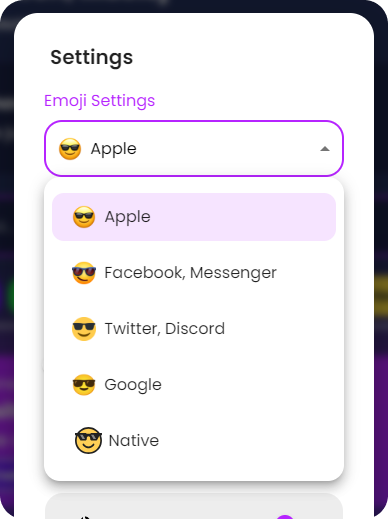
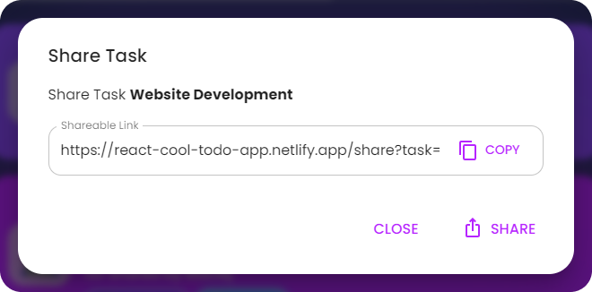
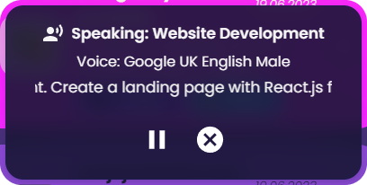
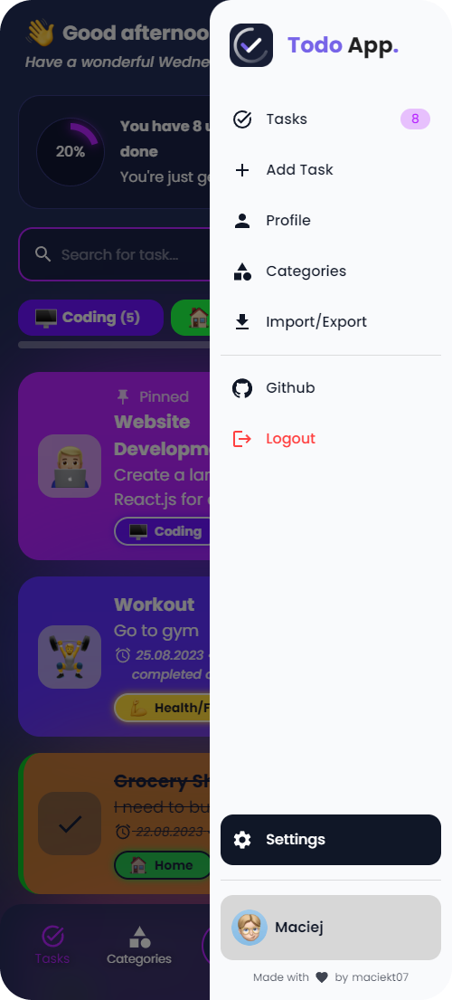
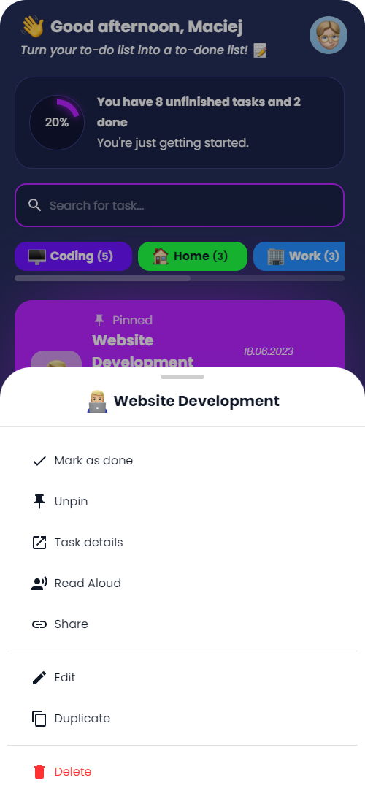
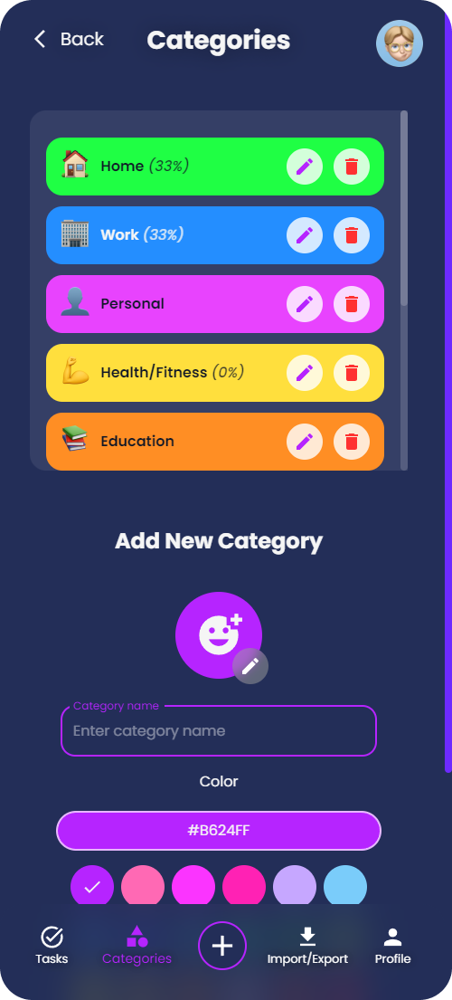
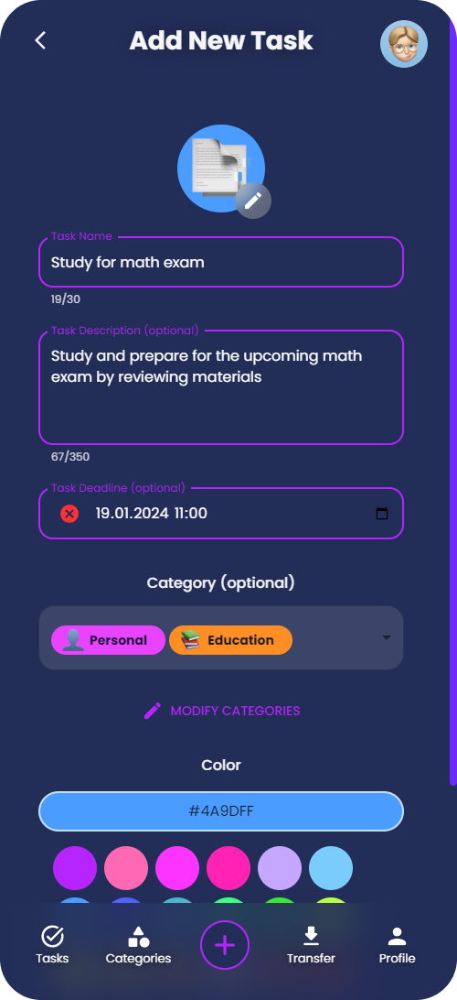
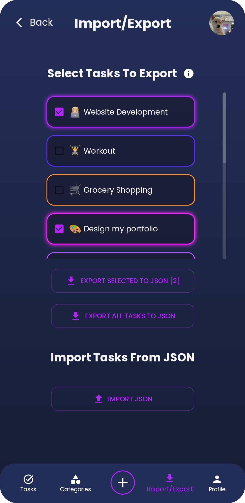
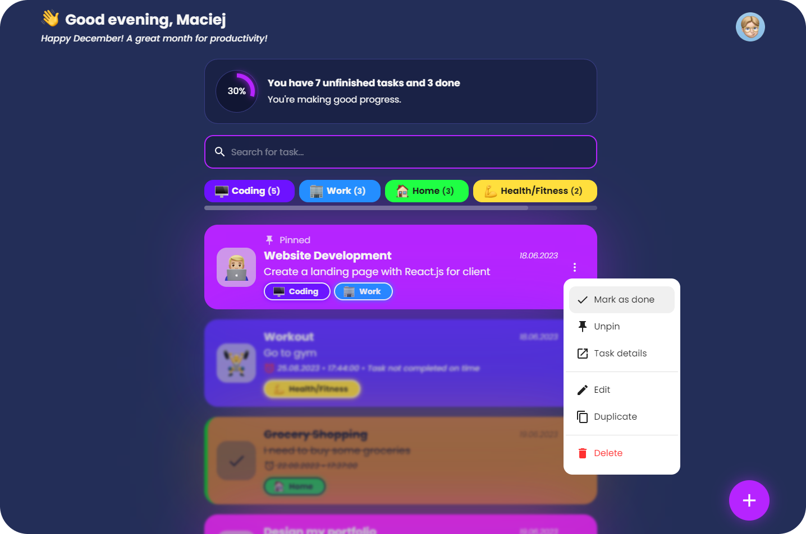

<!-- prettier-ignore -->

<h1>📝React.js Todo App</h1>

## [https://react-cool-todo-app.netlify.app/](https://react-cool-todo-app.netlify.app/)

## ⚡ Features

- **Local and session storage**: Save tasks locally and retain form data using session storage.
- **Custom Emojis**: The app features different emoji styles to choose from, including Apple, Facebook, Twitter, Google and Native.
<!--   -->
- **Share tasks by link**: Easily share your tasks with others using a link. [Example Link](https://react-cool-todo-app.netlify.app/share?task=%7B%22id%22%3A1705265234363%2C%22done%22%3Afalse%2C%22pinned%22%3Atrue%2C%22name%22%3A%22Website%20Development%22%2C%22description%22%3A%22Create%20a%20landing%20page%20with%20React.js%20for%20client%22%2C%22emoji%22%3A%221f468-1f3fc-200d-1f4bb%22%2C%22color%22%3A%22%23b624ff%22%2C%22date%22%3A%222024-01-14T20%3A47%3A13.852Z%22%2C%22category%22%3A%5B%7B%22id%22%3A1687125417463.03%2C%22name%22%3A%22Coding%22%2C%22emoji%22%3A%221f5a5-fe0f%22%2C%22color%22%3A%22%236d12ff%22%7D%2C%7B%22id%22%3A2%2C%22name%22%3A%22Work%22%2C%22emoji%22%3A%221f3e2%22%2C%22color%22%3A%22%23248eff%22%7D%5D%2C%22lastSave%22%3A%222024-01-14T20%3A47%3A30.316Z%22%2C%22deadline%22%3A%222024-01-31T15%3A50%22%7D&userName=Maciej) 
<!--   -->
- **It has a clean and responsive design**, ensuring a smooth user experience across different devices.
- **Native Intl Integration**: Adapts to your language, timezone, and date preferences using the native `Intl` API
- **Customizable Categories**: Users can create and personalize task categories to suit their preferences.
- **Search Tasks**: Search functionality allows you to filter tasks by name or description, making it easy to find what you need.
- **Task Reading Aloud**: Option to have tasks read aloud, with a selection of voices to choose from.  
  
- **Import/Export Tasks**: Users can now import and export tasks to/from JSON files. This feature allows users to back up their tasks or transfer them to other devices easily.
- **Works offline**: This app is a Progressive Web App (PWA), which means it can be installed on your device and used even when you're offline. You can access and manage your tasks without an internet connection, ensuring uninterrupted productivity.

## 📷 Screenshots

## 🚀 Performance

## 🌐 Tech Stack

- React
- Typescript
- Vite
- Emotion
- MUI

## 👨‍💻 Installation

To install and run the project locally, follow these steps:

- Clone the repository: `git clone https://github.com/maciekt07/TodoApp.git`
- Navigate to the project directory: `cd TodoApp`
- Install the dependencies: `npm install`
- Start the development server: `npm run dev`

The app will now be running at [http://localhost:5173/](http://localhost:5173/).

</a>
